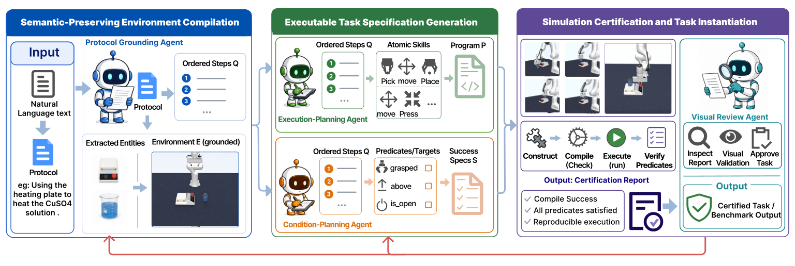
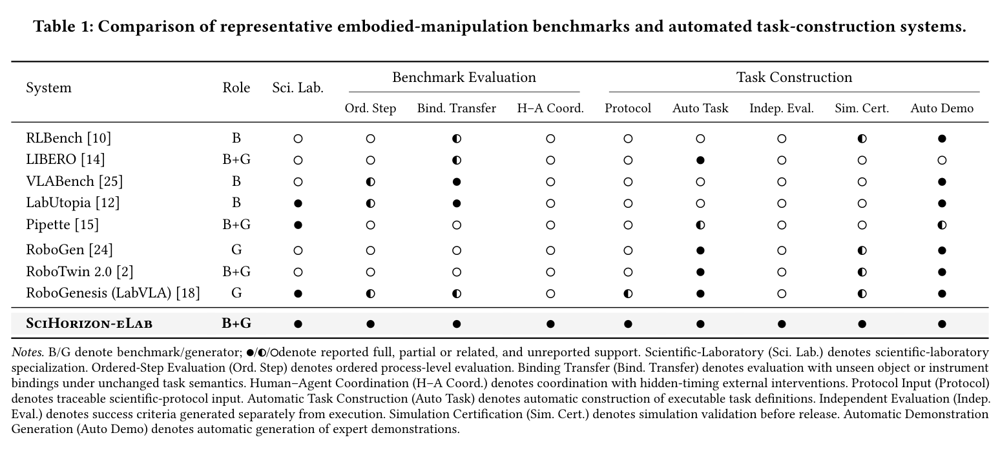

# SciHorizon-eLab

An agentic protocol-to-task compiler for scientific embodied agents, together with SciVLABench, the benchmark it produces.

📄 [**Paper (PDF)**](<docs/145_SciHorizon_eLab_An_Agentic%20(1)(2).pdf>) · 💻 [**Code**](https://github.com/SciHorizon-elab/SciHorizon-elab)

Existing laboratory benchmarks still depend on hand-written tasks. SciHorizon-eLab treats task construction as compilation: a natural-language protocol is turned into one simulator-ready task

$$
\tau = (E,\ P,\ S)
$$

where $E$ is the grounded simulation environment, $P$ is the robot-executable skill program, and $S$ is an ordered step-level success specification. $S$ is written without seeing $P$, so execution and evaluation stay independent.



*Figure 1. A protocol is compiled in three stages: semantic-preserving environment compilation, executable task specification, and simulation certification.*

## Compilation pipeline

Only candidates that pass compilation, physical execution, predicate verification, and visual-semantic review are certified.

1. **Semantic-preserving environment compilation.** A schema-constrained grounding agent extracts entities, ordered operations, and constraints, then binds them to simulator assets. Liquids and powders are modeled as contents or internal states of their carriers. Robot-specific motion details are deferred to the next stage.
2. **Executable task specification generation.** An execution-planning agent expands each grounded step into registered atomic skills, inserting implicit motions such as approach, grasp, and release without changing the protocol order. A separate condition-planning agent, which does not see the skill program, writes step-level success predicates over simulator state and time.
3. **Simulation certification and task instantiation.** The task is compiled into MuJoCo classes, executed, and checked by a predicate verifier and a visual-review agent. Certified tasks can then be instantiated under admissible randomization of poses, layouts, initial states, and visual conditions, without changing the procedure or the success specification.

In this repository the three stages are implemented in `scihorizon_elab/pipeline/`:

```text
analyzer → normalizer → asset_manager
        → skill_planner ∥ condition_planner
        → code_generator → registration → simulation
```



*Table 1. SciHorizon-eLab is the only system in this comparison that takes a scientific protocol as input and releases tasks only after simulation certification, with execution and evaluation specified separately.*

## SciVLABench

SciVLABench is the ready-to-use benchmark produced by the compiler. It does not require rerunning compilation to train or evaluate a policy.

| Resource | Scale |
| --- | --- |
| Protocol-grounded source scenarios | 51 |
| Registered atomic manipulation skills | 30 |
| Simulation-certified autonomous tasks | 300 |
| Human–agent coordination tasks | 15 |

The 51 source scenarios cover five operation families:

- Liquid Handling and Transfer
- Mixing and Agitation
- Solid Handling and Weighing
- Thermal Control and Incubation
- Apparatus and Workspace Interaction

Each certified task ships with a natural-language instruction, a grounded environment, an executable expert program, ordered success conditions, and certification metadata. Replaying the expert program under different seeds yields demonstrations, observations, traces, and step-level verification records on demand.

### Evaluation protocols

- **Same-task randomized evaluation.** Train and test on independently sampled instances of the same certified task.
- **Held-out object-binding evaluation.** Replace the training object with a geometrically different object while keeping the operation and success specification fixed.
- **Human–agent coordination.** Randomize the timing of an external event, such as igniting a lamp or adding material. The policy must wait, detect the event from RGB observations, and then finish the procedure.

Reported metrics are task success rate (SR), which requires every step condition in order, and step-wise success rate (SSR), which measures how much of the procedure is completed before failure. Coordination tasks additionally report premature violation rate (PVR) and post-trigger response latency.

On ten representative tasks, ACT reaches the highest average success rate (**49.7%**), while $\pi_{0.5}$ reaches the highest average step-wise success (**61.4%**). Diffusion Policy averages 30.0% success. Human–agent coordination stays below 17% even when no policy touches a restricted object too early. On 100 in-scope commands, 58% certify on the first pass and **81%** certify after automatic simulator reruns and visual-state correction. The rest take about 1–2 minutes of human correction each.

## Installation

Python 3.10. Two ways to build the environment:

**Option A (recommended): recreate the locked environment**

```sh
git clone https://github.com/SciHorizon-elab/SciHorizon-elab.git
cd SciHorizon-elab

conda env create -f environment.yml   # creates env "vlabench_2"
conda activate vlabench_2

pip install -e src/rrt-algorithms
pip install -e .
```

**Option B: install pinned requirements into a new environment**

```sh
conda create -n scihorizon_elab python=3.10
conda activate scihorizon_elab

git clone https://github.com/SciHorizon-elab/SciHorizon-elab.git
cd SciHorizon-elab
pip install torch==2.10.0 torchvision==0.25.0 --index-url https://download.pytorch.org/whl/cu128
pip install -r requirements-lock.txt
pip install -e src/rrt-algorithms
pip install -e .
```

`requirements-lock.txt` pins the working stack (torch 2.10.0+cu128, mujoco 3.2.2, dm_control 1.0.22, numpy 2.2.6). Configuration lives in `scihorizon_elab/configs/`.

Optional policy submodules, including the OpenPI tree used for $\pi_{0.5}$:

```sh
git submodule update --init --recursive
```

## Compile a protocol into a task

```sh
python -m scihorizon_elab.pipeline.create_task "lift the beaker"

python -m scihorizon_elab.pipeline.create_task "pick up the tube" \
    --task-name custom_tube_lift

python -m scihorizon_elab.pipeline.create_task "place the beaker" \
    --save-dir ./benchmark/tasks/autogen_tasks/experiments/

python -m scihorizon_elab.pipeline.create_task "lift the beaker" --no-simulate
```

`--save-dir` must stay inside the repository. `--no-simulate` still generates and registers the task, and skips MuJoCo execution.

## Expert demonstrations

Certified expert programs are replayed with `scripts/trajectory_generation.py`. A multi-process example is `sh/dataset_generation.sh`:

```sh
python scripts/trajectory_generation.py \
    --task-name <task_name> \
    --n-sample 10 \
    --start-id 0 \
    --save-dir /path/to/trajectory/dataset
```

Each trajectory is stored as HDF5. Convert it for downstream training with:

```sh
# RLDS, for frameworks such as Octo and OpenVLA
python scripts/convert_to_rlds.py --task <task_list> --save_dir /path/to/dataset
cd /path/to/dataset/<task> && tfds build

# LeRobot, for pi0.5
python scripts/convert_to_lerobot_pi.py \
    --dataset-name <dataset-name> \
    --dataset-path /path/to/dataset \
    --max-files 100

# LeRobot at 256x256, for ACT
python scripts/convert_to_lerobot_act.py ...
```

The LeRobot dataset is written under `HF_HOME/lerobot/<dataset-name>` by default.

## Training and evaluation

The paper evaluates three visuomotor policies, each trained per task on demonstrations from the certified expert program. Policies see four RGB views (three workspace cameras and one wrist camera) plus proprioception, and predict a 7D end-effector command. Privileged simulator state is used only to generate demonstrations and to score outcomes.

| Policy | Image size | Optimization |
| --- | --- | --- |
| π<sub>0.5</sub> | 480×480 | 100K steps, lr 2.5×10<sup>−5</sup>, global batch 64 |
| ACT | 256×256 | 100K steps, AdamW, lr 1×10<sup>−4</sup>, batch 128, chunk 100, 10 Hz |
| Diffusion Policy | 256×256 | 100K steps, AdamW, lr 1×10<sup>−4</sup>, batch 128, 10 Hz |

Step-by-step commands for this repository:

- π<sub>0.5</sub>: [`docs/SOP/pi0.5_training_sop.md`](docs/SOP/pi0.5_training_sop.md), [`docs/SOP/pi0.5评测.md`](docs/SOP/pi0.5评测.md)
- ACT: [`docs/SOP/act_training_sop.md`](docs/SOP/act_training_sop.md)
- Diffusion Policy: [`docs/SOP/dp_training_sop.md`](docs/SOP/dp_training_sop.md)

Evaluate a checkpoint in simulation:

```sh
python scripts/evaluate_policy.py \
    --policy act \
    --tasks <task_name> \
    --n-episode 30 \
    --model_ckpt /path/to/checkpoint
```

`--policy` also accepts `dp` and `openpi`. Unless noted otherwise, the paper uses 30 independently sampled episodes per checkpoint.

## Citation

```bibtex
```
